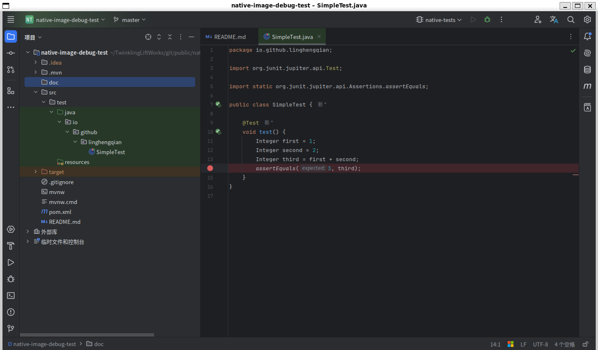
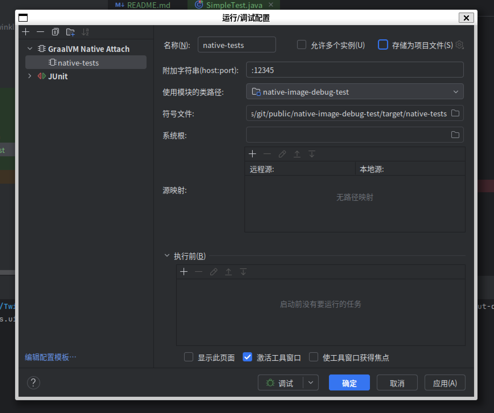
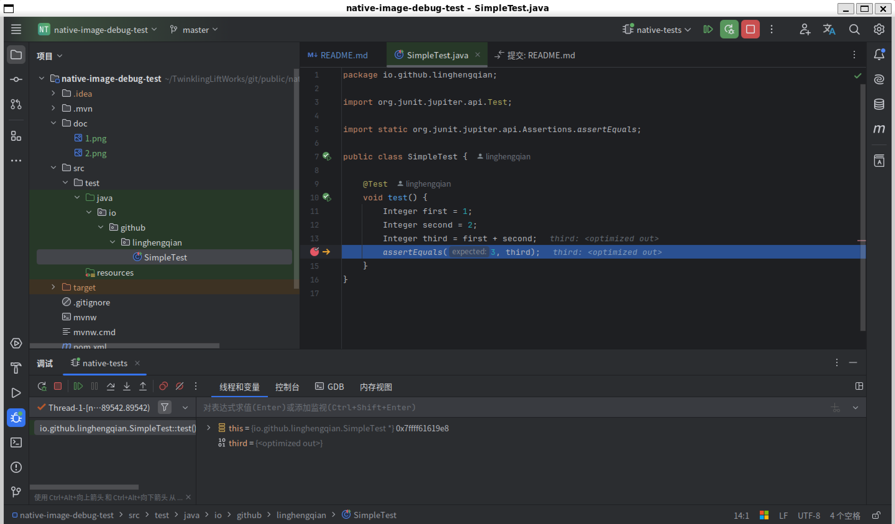

# native-image-debug-test

- For https://github.com/apache/shardingsphere-elasticjob/pull/2428 .

- Execute the following command on Ubuntu 22.04.4 with `SDKMAN!` installed.

```shell
sdk install java 22.0.2-graalce

sudo apt update && sudo apt upgrade -y
sudo apt install build-essential gdb -y
sudo apt install gdbserver -y

git clone git@github.com:linghengqian/native-image-debug-test.git
cd ./native-image-debug-test/
sdk use java 22.0.2-graalce
./mvnw -PnativeTestInCustom -T1C -e clean test
```

- Install the IDE plugins https://plugins.jetbrains.com/plugin/19237-graalvm-native-debugger
  and https://plugins.jetbrains.com/plugin/12775-native-debugging-support
  for IntelliJ IDEA 2024.2.0.1 (Ultimate Edition).

- Set a breakpoint.
- 
- A new profile is added in IntelliJ IDEA 2024.2.0.1 (Ultimate Edition).
- 

- Start the GraalVM Native Image on host port `12345`.

```shell
gdbserver :12345 ./target/native-tests --xml-output-dir ./target/native-test-reports -Djunit.platform.listeners.uid.tracking.output.dir=./target/test-ids
```

- Switch to the newly set run/debug configuration and press `shift+F9` to start debugging.

- At this time, it is not possible to view the actual value of the variable.

- 
